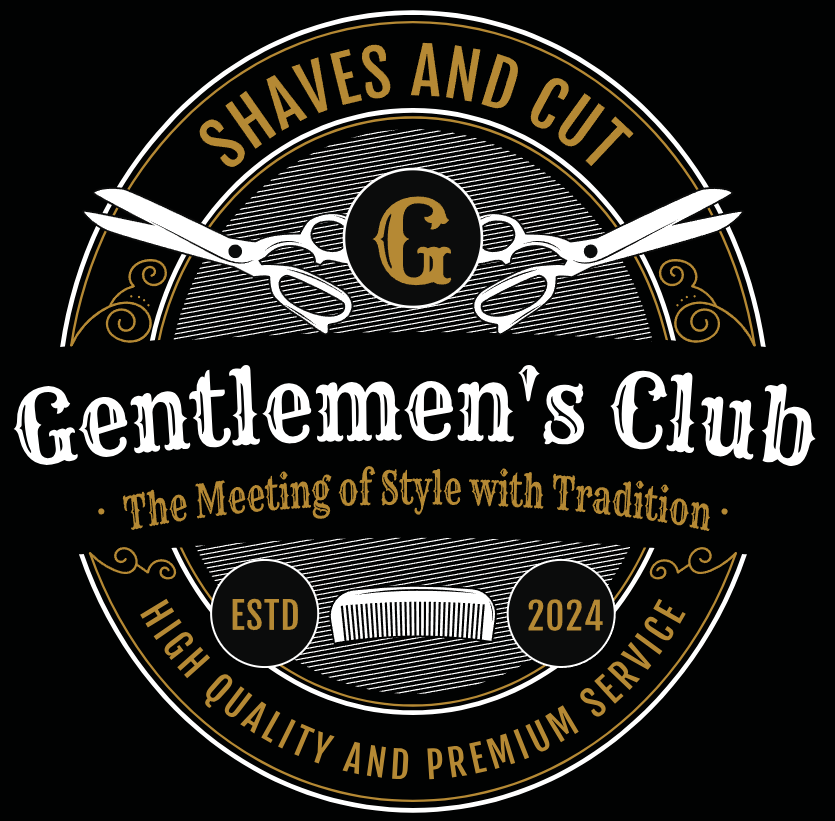

# Gentlemen's Club

Este programa está sendo construído como desafio final do curso formação dev FullStack MaisPraTI.

## Hospedagem / Deploy

Ainda em construção !

## Relatar um problema

Caso haja qualquer problema de execução da página entre em contato com um de nossos colaboradores. 

## 🛠️ Tecnologias utilizadas

 
 
 
 
 
 
 

## ✒️ Autor

Equipe Gentlemen's Club